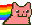

# Nyan Cat README

This is an extension "nyancat" which is a port of "parrot-mode" combined with the nyan cat for vscode. This enables you to have a nyan cat on your status bar and also allows you to rotate words quickly.

## Features

Choose nyan cat to display on status bar by defining the following in you config

    "NyanCat.name": "nyan-vday"

 

### Usage
 

Default key bindings

Description | Command 
--- | --- 
rotate forward | ctrl + ]
rotate backward | ctrl + [

 

## Requirements

    vscode version ~1.48

## Extension Settings

* `NyanCat.backgroundColor`: any css color
* `NyanCat.name`: set to `nyan-(name)` to change cat
* `NyanCat.dict`: add custom set of words to rotate through

## Uninstall
 

In command palette

    > Nyan Uninstall

> Important: Before uninstalling use Nyan Uninstall action

 

## Known Issues

- Vscode warns about corrupt files
- Some gifs may cause unexpected behavior...

## Release Notes

### 1.0.0

Initial release of Nyan Cat

-----------------------------------------------------------------------------------------------------------
 

**Enjoy!**
